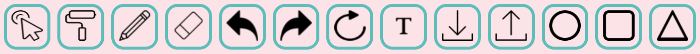
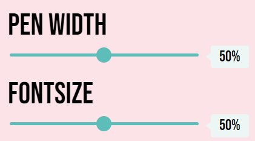
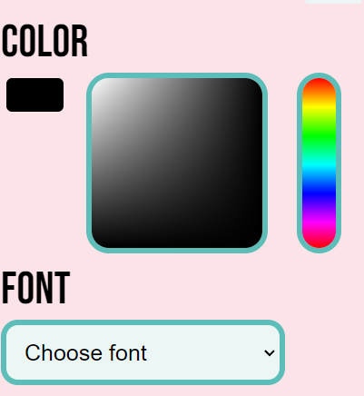
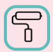
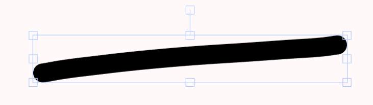

# Software Studio 2023 Spring
## Assignment 01 Web Canvas

### Scoring

| **Basic components**                             | **Score** | **Check** |
| :----------------------------------------------- | :-------: | :-------: |
| Basic control tools                              | 30%       | Y         |
| Text input                                       | 10%       | Y         |
| Cursor icon                                      | 10%       | Y         |
| Refresh button                                   | 5%       | Y         |

| **Advanced tools**                               | **Score** | **Check** |
| :----------------------------------------------- | :-------: | :-------: |
| Different brush shapes                           | 15%       | Y         |
| Un/Re-do button                                  | 10%       | Y         |
| Image tool                                       | 5%        | Y         |
| Download                                         | 5%        | Y         |

| **Other useful widgets**                         | **Score** | **Check** |
| :----------------------------------------------- | :-------: | :-------: |
| Name of widgets                                  | 1~5%     | N         |

---

### How to use 

Click the button and use the corresponding function.

adjust the text size and pen width.

change the color and font

### Bonus Function description
1. Special brush 
   
   it can be consider as a brush with special effect when drawing. 

    

2. Objector selector
   
    it can select any object in the canva and change object's size, length, width and direction.

    
 Decribe your bonus function and how to use it.

### Web page link

[Zack's canva](https://canvas-de959.firebaseapp.com/)

### Others (Optional)

    Thank's TA!

